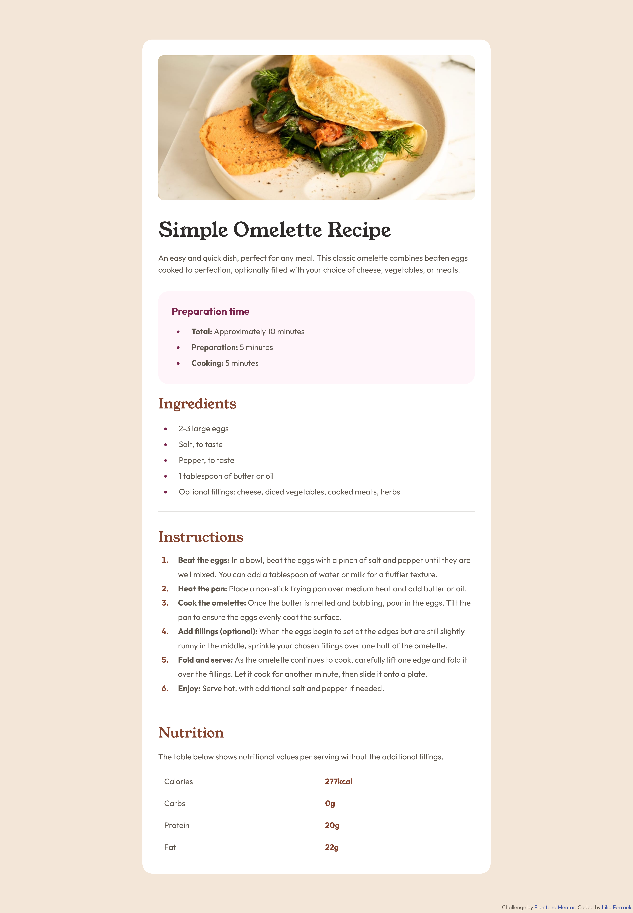
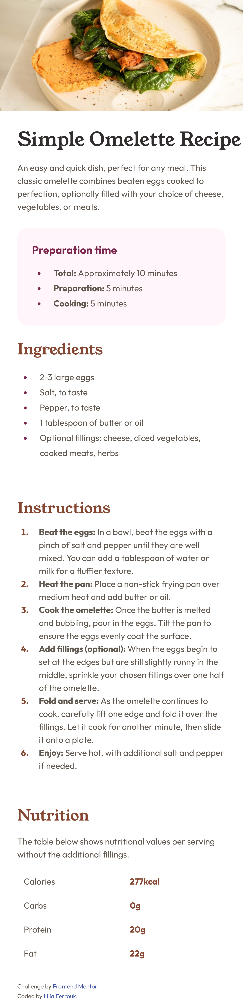

# Frontend Mentor - Recipe page solution

This is a solution to the [Recipe page challenge on Frontend Mentor](https://www.frontendmentor.io/challenges/recipe-page-KiTsR8QQKm). Frontend Mentor challenges help you improve your coding skills by building realistic projects. 

## Table of contents

- [Overview](#overview)
  - [The challenge](#the-challenge)
  - [Screenshot](#screenshot)
  - [Links](#links)
- [My process](#my-process)
  - [Built with](#built-with)
  - [What I learned](#what-i-learned)
  - [Continued development](#continued-development)
  - [Useful resources](#useful-resources)
- [Author](#author)


## Overview

### The challenge
Throughout this project, the primary challenge revolved around creating these responsive web pages using the programming language of my choice.

### Screenshot
A screenshot of my solution from a desktop:


An other one from a mobile:



### Links

- Solution URL: [github.com/liliaferrouk/recipe-page-main](https://github.com/liliaferrouk/recipe-page-main)
- Live Site URL: [liliaferrouk.github.io/recipe-page-main/](https://liliaferrouk.github.io/recipe-page-main/)

## My process

### Built with

- HTML5
- CSS

### What I learned

During this project, I acquired several valuable insights and skills:

- **Using Flexbox:**
  - Flexbox is a powerful layout model in CSS that enables flexible and efficient design structures. I learned how to utilize Flexbox to create dynamic and responsive layouts, making it easier to manage the positioning and alignment of elements within containers.

- **Styling Tables:**
  - I explored the usage of CSS selectors like `nth-child` and `last-child` to style tables effectively. These selectors allowed me to target specific table rows or cells and apply customized styling, enhancing the readability and visual appeal of the tables in my project.

```css
tr{
    border-bottom: 0.5px solid hsl(30, 10%, 34%);
}
tr:last-child{
    border-bottom: 0;
}
```

- **Styling Lists:**
  - I discovered the `::marker` pseudo-element in CSS, which provided me with the ability to customize the appearance of list item markers. By utilizing `::marker`, I gained greater control over the visual presentation of lists, making them more aesthetically pleasing and improving overall user experience.

```css
ul li::marker{
    color: hsl(332, 51%, 32%);
}
```

These newfound skills have not only expanded my proficiency in front-end development but also equipped me with the knowledge to create more polished and user-friendly interfaces in future projects.


### Continued development

In future projects, I aim to focus on :

- **Architectural Planning:**
  I recognize the importance of creating a solid overall architecture before diving into coding to minimize code repetition and ensure a more organized and scalable project structure. 


### Useful resources

- [CSS List Styles Tutorial for Beginners](https://www.youtube.com/watch?v=jcThx0U066w&t=658s) - This helped me with styling my lists and table.


## Author

- Frontend Mentor - [@liliaferrouk](https://www.frontendmentor.io/profile/liliaferrouk)